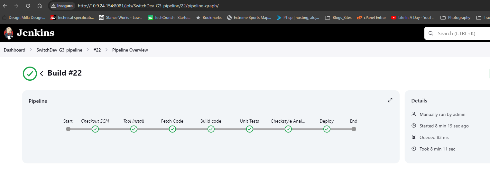

External Server Deploy in DEI cloud with Ubuntu:

## Application preparation:
pom.xml: double-check the <name> aligns with the .war file name (without the version and SNAPSHOT part of the name), add <packaging>war</packaging>, add dependencies
```
<groupId>org.switch2023</groupId>
<artifactId>switch2023project_g3</artifactId>
<name>switch2023project_g3</name>
<version>1.0-SNAPSHOT</version>
<packaging>war</packaging>

<!--        adding the mysql dependency, our database from IESP dei cloud-->
<dependencies>
   <dependency>
       <groupId>com.mysql</groupId>
       <artifactId>mysql-connector-j</artifactId>
       <scope>runtime</scope>
   </dependency>

<!--        declaring usage of external tomcat-->
   <dependency>
       <groupId>org.springframework.boot</groupId>
       <artifactId>spring-boot-starter-tomcat</artifactId>
       <scope>provided</scope>
   </dependency>
</dependencies>
```

## Launching the Ubuntu 22.04 machine that will run Tomcat 10 Service and host our application:
0- ssh or enter terminal from the machine and run:
1- apt-get update
2- apt-get install -y git
3- ssh-keygen -t rsa -b 4096 -C "1060598@isep.ipp.pt"
4- eval $(ssh-agent -s)
5- ssh-add ~/.ssh/id_rsa
6- cat ~/.ssh/id_rsa.pub
7- vim ~/.ssh/config
8- paste the following
Host github.com
Hostname ssh.github.com
Port 443
9- ssh -T git@github.com

## Tomcat10 installation:

```
cd /tmp
mkdir tomcat10
cd tomcat10
wget https://downloads.apache.org/tomcat/tomcat-10/v10.1.24/bin/apache-tomcat-10.1.24.tar.gz
tar xzf apache-tomcat-10.1.24.tar.gz
mv apache-tomcat-10.1.24 /opt/tomcat
vim /etc/systemd/system/tomcat.service
```

Declaring the tomcat.service in the Ubuntu machine:
```
[Unit]
Description=Apache Tomcat Web Application Container
After=network.target

[Service]
Type=forking

Environment=JAVA_HOME=/usr/lib/jvm/java-17-openjdk-amd64
Environment=CATALINA_PID=/opt/tomcat/temp/tomcat.pid
Environment=CATALINA_HOME=/opt/tomcat
Environment=CATALINA_BASE=/opt/tomcat
Environment='CATALINA_OPTS=-Xms512M -Xmx1024M -server -XX:+UseParallelGC'
Environment='JAVA_OPTS=-Djava.awt.headless=true -Djava.security.egd=file:/dev/./urandom'

ExecStart=/opt/tomcat/bin/startup.sh
ExecStop=/opt/tomcat/bin/shutdown.sh

User=tomcat
Group=tomcat
UMask=0007
RestartSec=10
Restart=always

[Install]
WantedBy=multi-user.target
```

Changing ownership and permissions to execute tomcat:/app:
```
groupadd tomcat
useradd -r -s /bin/false -g tomcat -d /opt/tomcat tomcat
chown -R tomcat:tomcat /opt/tomcat
chmod -R 755 /opt/tomcat
systemctl daemon-reload
systemctl start tomcat
systemctl enable tomcat
systemctl status tomcat
```

## Get the files from repository and deploy the .war (old way):
```
git clone git@github.com:Departamento-de-Engenharia-Informatica/2023-2024-switch-dev-project-assignment-grupo-3.git
cd 2023-2024-switch-dev-project-assignment-grupo-3
# since the prod profile is set as default, no need to run: mvn clean install -Pprod
mvn clean install
cp ./target/switch2023project_g3-1.0-SNAPSHOT.war /opt/lib/tomcat/webapps
# Tomcat restart might be needed after this step, so:
systemctl restart tomcat
```

## Access to the deployed application:
http://10.9.24.154:8080/switch2023project_g3-1.0-SNAPSHOT/api/v1/houses

## Docker could also be a suitable solution but in DEI we miss permissions to do so:
```
docker pull bitnami/tomcat

docker run --name tomcat -e TOMCAT_PASSWORD="123" -p 8080:8080 bitnami/tomcat:latest

docker cp "path/to/switch2023project_g3-1.0-SNAPSHOT.war" tomcat:/app
```

Only these 3 commands are enough

## Why not using Tomcat server (machine 85) from DEI?
The Tomcat server from DEI (no. 85) usually crashes with files over around 50mb, but sometimes it works. The problem is that we get permission denied to access the page and we can't ssh into the machine to add permissions.

# Environments
## Creating environments:
application.properties:
```
spring.profiles.default=prod
spring.jpa.show-sql=true
springdoc.swagger-ui.path=/swagger-ui.html
springdoc.api-docs.path=/api-docs
```

application-prod.properties:
```
spring.datasource.url=jdbc:mysql://vs465.dei.isep.ipp.pt:3306/smarthome
spring.datasource.username=root
spring.datasource.password=1UNfIX4XS2Gn
spring.datasource.driver-class-name=com.mysql.cj.jdbc.Driver
spring.jpa.hibernate.ddl-auto=update
```

application-dev.properties:
```
spring.datasource.url=jdbc:h2:./src/main/resources/META-INF/smarthome
spring.datasource.username=SA
spring.datasource.password=
spring.datasource.driver-class-name=org.h2.Driver
spring.jpa.hibernate.ddl-auto=create-drop
spring.jpa.show-sql=true
springdoc.swagger-ui.path=/swagger-ui.html
springdoc.api-docs.path=/api-docs
server.port=8080
```

Setup the Intellij run configuration to use the dev environment. To use the prod configuration the VPN has to be turned on.
If Environment variables are defined, those also need to be defined at the Host OS.

## Describing and using the environments:
We're using different environments:
1. application.properties - describes default behaviour for our application through all the different environments
2. application-dev.properties - describes the *Development Environment* that runs our H2 database locally, generating 
the *smarthome.mv.db* file in root/resources/META-INF/ . This in-memory works just good for a quick test, but it has issues 
in some OSs causing the server to shut down periodically.
3. application-dev-docker.properties - describes the *Development Environment* with an H2 database containerized, so it 
run in isolation in a Linux environment solving the memory problem that was causing the server to shut down periodically.
With this approach it run stable in all OS.
It also has the advantage that the team don't have to install the H2 database locally, it just runs through Docker.
 - 3.1. On the first run, we need to build the image:
   ```
   docker build -f Dockerfile-db -t smarthome-db .
   ```
 - 3.2. Then we run a container from the image:
   ```
   docker run -d --name smarthome-db -p 9092:9092 smarthome-db
   ```
 - 3.3. The database will be accepting connections at 9092(Host):9092(Guest) and the Database Manager UI is exposed at port 8082
 - 3.4. For any subsequent runs, with Docker running in the host system, run:
   ```
   docker start smarthome-db
   ```
 - 3.5. We also prepared two *Postman Collection* that is at root/resources/. The collection *postman_collection.json*
runs all the endpoints available. The collection *dev_postman_collection.json* inserts the data into the database. To do so, in the start directory of the whole project:
 - 3.5.1. Start the Docker container with the database
 - 3.5.2. Start the SpringBoot Application in the *dev-docker* environment
 - 3.5.3. Run the script *inject_dev_data.sh* in the Git Bash:
   ```
   ./inject_dev_data.sh
   ```

4. application-prod - describes the *Production Environment* with a MySQL database hosted in a Docker Container at 
ISEP's DEI cloud.

## Frontend App and Server
1. The app will run on the same machine on ISEP's DEI Cloud but on a different server that exposes port 3000
2. We're using a *Nginx Server* for the moment to run the app. See https://ubuntu.com/tutorials/install-and-configure-nginx#1-overview
 - 2.1. How to install Nginx:
 ```
 sudo apt update
 sudo apt install nginx -y
 ```
 - 2.2. Setup nginx server:
 ```
 cd /etc/nginx/sites-enabled
 vim react-smart-home
 ```
 It's necessary to set up the server accordingly in the created file named react-smart-home, specially exposing port 3000:
 ```groovy
 server {
        listen 3000;
        listen [::]:3000;

        server_name 2023-2024-switch-dev-project-assignment-grupo-3.smarthome.com;

        root /var/www/dist;
        index index.html;

        location / {
             try_files $uri $uri/ =404;
        }

        location /api {
                add_header 'Access-Control-Allow-Origin' 'http://10.9.24.154:3000';
                add_header 'Access-Control-Allow-Methods' 'GET, POST, PATCH, PUT, OPTIONS';
                add_header 'Access-Control-Allow-Headers' 'Content-Type, Authorization';
                add_header 'Access-Control-Allow-Credentials' 'true';

                # Proxy_pass to the Tomcat server running on port 8080
                proxy_pass http://10.9.24.154:8080/switch2023project_g3-1.0-SNAPSHOT/api/v1/;
        }
 }
 ```
 - 2.3. Copy the *dist* directory generated at the frontend build to nginx:
 ```
 cp -ru 2023-2024-switch-dev-project-assignment-grupo-3/src/main/resources/static/* /var/www/dist/
 ```
 - 2.4. Restart the nginx server:
 ```
 sudo service nginx restart
 ```
- 2.5. Tomcat will still block incoming requests although we now have a reverse proxy in place.
To solve this, in the VM add to web.xml in the general tomcat config at vim */opt/tomcat/conf/web.xml*:
```xml
<filter>
   <filter-name>CorsFilter</filter-name>
   <filter-class>org.apache.catalina.filters.CorsFilter</filter-class>
   <init-param>
      <param-name>cors.allowed.origins</param-name>
      <param-value>http://10.9.24.154:3000, http://127.0.0.1:5137</param-value>
   </init-param>
   <init-param>
      <param-name>cors.allowed.methods</param-name>
      <param-value>GET, POST, PUT, DELETE, OPTIONS</param-value>
   </init-param>
   <init-param>
      <param-name>cors.allowed.headers</param-name>
      <param-value>Content-Type, Authorization</param-value>
   </init-param>
</filter>
<filter-mapping>
    <filter-name>CorsFilter</filter-name>
    <url-pattern>/*</url-pattern>    
</filter-mapping>
```
 - 2.6. Restart tomcat:
 ```
 sudo systemctl restart tomcat
 ```
 - 2.7. Server will be running on http://10.9.24.154:3000/

## Bundling Backend Server with Frontend app:
1. Generated maven-wrapper to use optionally instead of having to install maven.
```
mvn -N io.takari:maven:wrapper
```

2. Added the following stages to pom.xml
```xml
<!--			install node and npm, install node_modules, build react app-->
    <plugin>
    <groupId>com.github.eirslett</groupId>
    <artifactId>frontend-maven-plugin</artifactId>
    <version>1.6</version>
    <executions>
        <execution>
            <id>install node and npm</id>
            <goals>
                <goal>install-node-and-npm</goal>
            </goals>
            <phase>generate-resources</phase>
            <configuration>
                <nodeVersion>v18.12.1</nodeVersion>
                <npmVersion>8.19.2</npmVersion>
            </configuration>
        </execution>
        <execution>
            <id>npm install</id>
            <goals>
                <goal>npm</goal>
            </goals>
            <phase>generate-resources</phase>
            <configuration>
                <arguments>install</arguments>
            </configuration>
        </execution>
        <execution>
            <id>npm run build</id>
            <goals>
                <goal>npm</goal>
            </goals>
            <phase>generate-resources</phase>
            <configuration>
                <arguments>run build</arguments>
            </configuration>
        </execution>
    </executions>
    <configuration>
        <nodeVersion>v18.12.1</nodeVersion>
        <workingDirectory>frontend</workingDirectory>
        <npmVersion>8.19.2</npmVersion>
    </configuration>
    </plugin>   
            <!--			copy react build artifacts to springboot-->
    <plugin>
    <groupId>org.apache.maven.plugins</groupId>
    <artifactId>maven-resources-plugin</artifactId>
    <version>3.3.1</version>
    <executions>
    <execution>
        <id>Copy Javascript app into SpringBoot</id>
        <phase>process-resources</phase>
        <goals>
            <goal>copy-resources</goal>
        </goals>
        <configuration>
            <outputDirectory>target/classes/static</outputDirectory>
            <outputDirectory>src/main/resources/static</outputDirectory>
            <resources>
                <resource>
                <directory>frontend/dist/</directory>
                </resource>
            </resources>
        </configuration>
    </execution>
    </executions>
    </plugin>
```
3. Now we can package the application, frontend and backend in a .war file that will be at /target/switch2023project_g3-1.0-SNAPSHOT.war.
This can be achieved with the command:
```
mvn package (or ./mvnw package)
```
## CI/CD
1. Implemented CI/CD manually with scripts since we can't use for example Jenkins because we don't have a token.
2. Generated a new ssh key with:
```
ssh-keygen -t rsa -b 4096 -C "1060598"
eval $(ssh-agent -s)
ssh-add ~/.ssh/id_rsa_dei
```
3. Now the key part was copying the ssh to the cloud VM so it's possible to automate the process without hanging up waiting to manual password input.
```
ssh-copy-id root@10.9.24.154

# ssh into the vm
ssh 'root@10.9.24.154'
chmod 600 ~/.ssh/id_rsa
chmod 700 ~/.ssh

# now it's possible to auth without password with commands prefixex with the path to the host ssh authorized key
ssh -i ~/.ssh/id_rsa_dei root@10.9.24.154
```
4. Finally, we can create a post-push hook on git that executes the script *"cloud-deploy-script.sh"*.
This script will build the files, on error it exists, on success deploys to the servers. This is the solution we're going to use.
5. Since, copying the .war file fails often with our VPN+DEI cloud connection due to file size, created shorter versions
of the *"backend-deploy-script.sh"* and *"frontend-deploy-script.sh"* separately so we do not need to package the project 
from the beginning just to deploy one of the failing parts. 

## Automation with Jenkins
1. We need to install Jenkins, put it running on port 8081 and increased Java Heap Space to run the mvn package:
```
apt-get update
apt install -y openjdk-17-jdk # if already installed there's no need to install again
wget -O /usr/share/keyrings/jenkins-keyring.asc https://pkg.jenkins.io/debian-stable/jenkins.io-2023.key
echo deb [signed-by=/usr/share/keyrings/jenkins-keyring.asc] https://pkg.jenkins.io/debian-stable binary/ | sudo tee /etc/apt/sources.list.d/jenkins.list > /dev/null
apt-get update
apt-get install jenkins -y
sudo vim /lib/systemd/system/jenkins.service

# set Environment="JENKINS_PORT=8081"
sudo systemctl daemon-reload
sudo systemctl restart jenkins
sudo vim /etc/default/jenkins

# to increase Jenkins Heap Space
JAVA_ARGS="-Djava.awt.headless=true -Xmx2048m -XX:MaxMetaspaceSize=512m"

# to allow copy of the artifacts
sudo chown -R jenkins:jenkins /opt/tomcat/webapps /var/www/dist
sudo systemctl restart jenkins

# add jenkins as sudoer to enable systemctl restart
sudo visudo

# add line: jenkins ALL=(ALL) NOPASSWD: ALL
```
2. Then create, at the root directory of the project a file named "Jenkinsfile" with the following pipeline code:
```groovy
pipeline {
  agent any
  tools {
    maven "MAVEN3"
    jdk "OracleJDK17"
  }
  stages {
    stage ('Fetch Code') {
      steps {
        git branch: 'main', credentialsId: 'GitHubIsep', url: 'https://github.com/Departamento-de-Engenharia-Informatica/2023-2024-switch-dev-project-assignment-grupo-3.git'
      }
    }

    stage ('Build code') {
      steps {
        sh 'mvn clean package -DskipTests'
      }

      post {
        success {
          echo 'Archiving artifacts now.'
          archiveArtifacts artifacts: '**/*.jar'
        }
      }
    }

    stage('Unit Tests') {
      steps {
        catchError(buildResult: 'SUCCESS', stageResult: 'FAILURE') {
          sh 'mvn test'
        }
      }
    }

    stage('Checkstyle Analysis') {
      steps {
        sh 'mvn checkstyle:checkstyle'
      }
    }

    stage('Deploy') {
      steps {
         sh 'cp target/switch2023project_g3-1.0-SNAPSHOT.war /opt/tomcat/webapps/'
         sh 'cp -r frontend/dist/* /var/www/dist/'
         echo 'Restarting Services...'
         sh 'sudo systemctl restart tomcat && sudo systemctl restart nginx'
      }
    }
  }
}
```
3. We need to setup Jenkins, declaring the tools Maven (with name MAVEN3) and the OpenJDK (with name OracleJDK17 pointing to /usr/lib/jvm/java-17-openjdk-amd64)
4. Also, we need to Generate a GitHubToken and create credentials, named in this case GitHubIsep as Username + Password authentication, 
in which the user is the GitHub user email and password is the Token.
5. After this, it's just a matter of creating a pipeline mentioning it should run Pipeline from SCM,
give it the correct repository url, credentials and branch.
6. For a fully automated process, we also would be using a valid Token from *Departamento-de-Engenharia-Informatica* 
so we can define GitHub Build Triggers at Jenkins and at Github settings create a Webhook to listen to Push events 
on the repository and therefore triggers the pipeline to run automatically and in case of success it will also deploy the changes automatically.
7. We found 2 problems with this approach:
 - 7.1. We don't have permissions to generate Tokens at *Departamento-de-Engenharia-Informatica*
 - 7.2. The Ubuntu 22.04 VM we're using runs our of Heap Space when building the .war file, causing the pipeline to fail
and therefore not deploying the artifacts. Additionally, we don't have permissions to create new machines with more 
allocated memory.
8. Locally, running a similar machine with Vagrant (with 4096MB of memory) we ran successfully the automatic build, 
test and deploy with the presented pipeline.
9. To solve this problem, go to *Manage Jenkins > System > Global Properties > Environment Variables* and add
```
# Name:
MAVEN_OPTS
# Value:
-Xmx2g
```
10. Then run the the pipeline and it will execute all the steps successfully.


